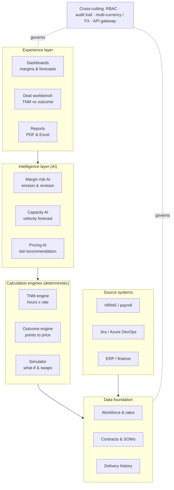
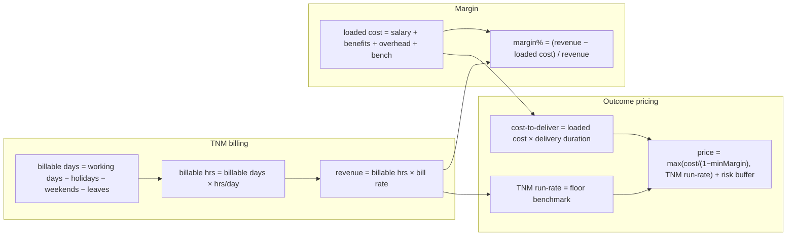
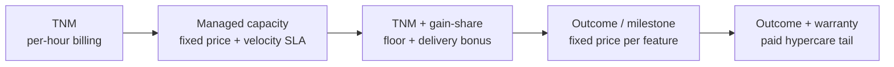
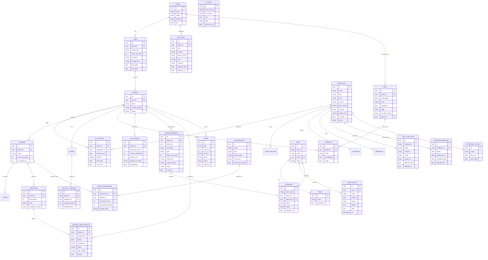
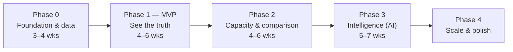

# Opus Pulse — Business Requirements Document (BRD)

**Delivery Economics & Outcome Engineering Platform**

---

## Document control

| Field | Value |
|---|---|
| Document title | Opus Pulse — Business Requirements Document |
| Product name | Opus Pulse |
| Version | 1.2 |
| Status | For development hand-off |
| Owner | Office of the Chief Delivery Officer, Opus |
| Audience | Engineering team / AI development agent, Product, Finance, Delivery Leadership |
| Classification | Confidential — contains commercial pricing and cost logic |

| Version | Date | Author | Summary of change |
|---|---|---|---|
| 0.1 | — | CDO Office | Initial draft from requirement |
| 1.0 | — | CDO Office | Baselined for development |
| 1.1 | — | CDO Office | Added Story Point Economics (Module I) and Delivery Marketplace (Module J); expanded loaded-cost components, AI-model suite, and what-if scenarios |
| 1.2 | — | CDO Office | Closed pre-implementation gaps: added Change Request & Scope Mgmt (K), Revenue Recognition & WIP (L), Alerts & Early-Warning (M), Deal Pipeline & Win/Loss (N), Bench & Utilization (O), Approvals & Sign-off (P); extended multi-model pricing (F), FX exposure on fixed-price (C), portfolio-migration planner (G); added data-model entities (USER/ROLE, FX_RATE, COST_LINE_ITEM, ALLOCATION, APPRAISAL_CYCLE, AUDIT_EVENT, CHANGE_REQUEST, REVENUE_RECOGNITION, ALERT, DEAL, APPROVAL, UTILIZATION_RECORD, CLIENT attrs); expanded NFRs (accessibility, data residency, retention, backup/DR, observability) and AI governance (model monitoring/drift, fairness) |

---

## 1. Executive summary

Opus is a ~1,000-person global software services company whose revenue is dominated by **Time-and-Material (TNM)** contracts billed per hour against client Statements of Work (SOWs). This model has a structural weakness: **revenue per resource is contractually frozen at the SOW bill rate, while cost rises every year** (annual appraisals of ~7%, attrition-driven backfills at higher cost, ramp-up loss). The result is silent margin erosion — a 20% margin compresses to single digits over a multi-year engagement, and recovery depends entirely on the client agreeing to a rate revision.

**Opus Pulse** is the platform that makes this economics visible, predictable, and actionable. It allows Opus to:

1. **Measure true, fully-loaded margin** per resource, project, and client in real time, and forecast annual billing income.
2. **Predict margin erosion** using AI and rank engagements as *revise*, *convert*, or *exit* candidates.
3. **Model the conversion of a TNM engagement to outcome-based (or hybrid) delivery**, with a defensible, AI-recommended price.
4. **Prove the upside** with side-by-side comparison, what-if simulation (resource swaps, story-point sizing, velocity, pricing levers) and downloadable client-facing and internal reports.
5. **Govern the shift end-to-end** — control scope changes on fixed-price work, recognize revenue correctly per delivery model (WIP/ASC 606), enforce maker-checker approvals on sensitive pricing, and raise **early-warning alerts** before margin is lost.

The platform is designed to be **enterprise-grade, multi-currency, audit-ready, and role-secured**, because it holds the two most sensitive data classes in the company: employee compensation and client bill rates.

---

## 2. Business context and problem statement

### 2.1 Current state (as-is)

- Most SOWs are **TNM, per-hour billing**, at **8 or 9 contracted hours/day** × working days in the period.
- Working days exclude weekends, public holidays, and employee leaves.
- Bill rates vary by **client × role × location × tenure × demand**. Illustrative (not actual) sample rates:
  - India: **$30–$50/hr**
  - US / UK / Canada: **$150–$200/hr**
- Margin per project is typically structured as **~80% cost (salaries + project cost) / ~20% Opus margin**.

### 2.2 The margin-erosion mechanics (the core problem)

| Driver | Effect on margin |
|---|---|
| Annual appraisal (e.g. 7% hike) | Cost rises; bill rate is frozen → margin compresses |
| Attrition + backfill | Replacement often hired at higher cost; same-cost backfill increasingly hard |
| Ramp-up / knowledge transfer | New joiner delivers below capacity for 1–2 sprints; hidden cost |
| Rate frozen for years | After 3–4 years a revision is requested, but is **client-discretionary** |
| Dependency exceptions | Only star/critical resources reliably win a revision |

**Consequence:** Opus absorbs cost inflation it cannot pass through. The margin "bleeds" with no early-warning system and no structured remedy.

### 2.3 The strategic response (to-be)

Shift selected engagements from TNM toward **outcome-based / milestone-based delivery**, where Opus is paid for delivered scope (e.g. story points / features) rather than time. This **decouples price from headcount cost**, so efficiency gains (higher velocity, cheaper resource mix, automation/AI) accrue to Opus margin instead of being returned to the client as fewer billed hours.

Opus Pulse operationalizes this shift and de-risks it through a **delivery-model portfolio** (see Section 11) rather than a single risky "TNM-to-fixed-price" jump.

---

## 3. Goals, objectives, and success metrics

### 3.1 Business goals

- **G1.** Arrest and reverse margin erosion across the TNM portfolio.
- **G2.** Enable confident, data-backed conversion of engagements to outcome/hybrid models.
- **G3.** Give leadership a single source of truth for delivery economics.
- **G4.** Increase win-rate and margin on new delivery-model proposals.

### 3.2 Product objectives

- **O1.** Real-time, fully-loaded margin visibility per resource / project / client.
- **O2.** Accurate annual billing-income forecast under configurable assumptions.
- **O3.** AI-driven margin-risk ranking with explainable drivers.
- **O4.** Evidence-based team and per-resource capacity in story points.
- **O5.** TNM-vs-outcome comparison with a clamped, AI-recommended price.
- **O6.** Self-service what-if simulation and downloadable reports.

### 3.3 Success metrics (KPIs)

| KPI | Target (illustrative) |
|---|---|
| Time to produce a margin view per project | < 5 seconds |
| Forecast accuracy (billing income, ±) | within ±5% at quarter close |
| Engagements with margin-risk score computed | 100% of active projects |
| Capacity forecast error vs. actual velocity | within ±10% (rolling 3 sprints) |
| Outcome bids priced ≥ cost floor and ≥ TNM run-rate | 100% (hard rule) |
| Proposal turnaround (TNM → outcome model) | from days to < 1 hour |
| Scope changes captured and re-priced (not absorbed silently) | 100% of accepted CRs |
| Early-warning lead time before margin-floor breach | ≥ 60 days |
| Win-rate uplift on new delivery-model proposals | +X pts vs baseline |
| Revenue-recognition / WIP accuracy vs Finance close | within ±2% |
| Active resources with utilization computed | 100% |

---

## 4. Stakeholders and personas

| Persona | Role | Primary needs | Sensitivity access |
|---|---|---|---|
| **Chief Delivery Officer (CDO)** | Executive sponsor | Portfolio margin health, conversion strategy, forecasts | Full (cost, rate, margin) |
| **Finance Controller** | Margin & revenue | Loaded cost, margin, revenue recognition, FX | Cost, margin, FX |
| **Account / Engagement Manager** | Client owner | Bill rates, proposals, comparison packs | Client rate, margin (own accounts) |
| **Delivery / Project Manager** | Team owner | Capacity, velocity, allocation, sizing | Velocity, allocation (no salary) |
| **Bid / Pricing Manager** | Proposals | Outcome pricing, what-if, win-rate | Rate, price, margin |
| **HR / Workforce Admin** | Master data | Employee data, leave, calendars | Salary/cost (admin) |
| **System Admin** | Platform | RBAC, integrations, audit | Configuration (no business data view by default) |

> **Privacy note:** Salary and individual cost are visible only to Finance, HR Admin, and CDO. Delivery Managers see capacity/velocity but **never** individual compensation.

---

## 5. Scope

### 5.1 In scope

- Workforce, rate, contract, calendar, and delivery-history master data.
- TNM billing calculation and annual forecast.
- Fully-loaded margin and cost engine.
- AI margin-erosion forecasting and revision/conversion/exit ranking.
- Velocity-based capacity engine (team and per resource).
- Outcome / milestone pricing engine + AI price recommendation.
- TNM-vs-outcome comparison and what-if simulation (resource swap, offshore shift, team-size, automation adoption).
- Story Point Economics (revenue/cost/profit/margin per story point).
- Delivery Marketplace (accelerator/GenAI productivity-to-margin intelligence, internal-only).
- Delivery-model portfolio (TNM, managed-capacity, gain-share, outcome, outcome+warranty).
- Change-request & scope-change management with re-pricing and approval.
- Revenue recognition & WIP / unbilled tracking per delivery model.
- Alerts & early-warning notifications with subscription digests.
- Deal pipeline & win/loss tracking.
- Bench & utilization visibility.
- Approvals / maker-checker workflow on sensitive pricing, rate revisions, and overrides.
- Executive and project dashboards; PDF/Excel/PPT report export.
- Multi-currency, RBAC, and full audit trail.

### 5.2 Out of scope (Phase 1)

- Payroll processing, invoicing, and general ledger postings (Opus Pulse **reads** from and **recommends to** these systems; it does not replace ERP/finance systems).
- Timesheet capture UI (consumed from existing systems).
- Recruitment / ATS workflow.
- Contract authoring / e-signature (SOW terms are captured as structured data, not generated).

### 5.3 Assumptions

- Source systems (HRMS, Jira/Azure DevOps, finance/ERP) expose data via API or scheduled extract.
- Loaded-cost overhead formula is agreed with Finance before go-live.
- Story-point scales differ by team and require normalization (handled by the platform).

---

## 6. Glossary

| Term | Definition |
|---|---|
| **TNM** | Time-and-Material; billing = hours × rate. |
| **SOW** | Statement of Work; the contractual basis for an engagement. |
| **Bill rate** | Rate charged to client per billable hour. |
| **Loaded cost** | Salary + benefits + overheads + bench allocation per resource. |
| **Margin** | (Revenue − loaded cost) ÷ revenue. |
| **Story point (SP)** | Relative size unit for delivered scope; team-specific. |
| **Velocity** | SP completed per sprint by a team/resource. |
| **PI** | Program Increment (SAFe), typically 4–6 sprints. |
| **Outcome-based** | Payment for delivered scope/milestones, not time. |
| **Managed capacity** | Fixed price for a committed pod with a velocity SLA. |
| **Gain-share** | TNM floor + bonus for hitting a delivery/velocity target. |
| **Run-rate** | Current periodic revenue/cost level if unchanged. |
| **Focus factor** | Fraction of available time spent on deliverable work (non-meeting). |
| **Change request (CR) / Change order** | A post-agreement scope change, re-sized and re-priced before acceptance. |
| **Revenue recognition** | The accounting point at which revenue is earned (per ASC 606 / IFRS 15), distinct from when it is billed. |
| **WIP / unbilled** | Work-in-progress: delivered value not yet billed/accepted; deferred revenue is the inverse. |
| **Utilization** | Billable allocation ÷ available capacity for a resource/team over a period. |
| **Bench** | Unallocated / non-billable resource time carried as cost. |
| **Maker-checker** | Control pattern where a sensitive action by one user requires approval by another. |

---

## 7. Solution architecture

Opus Pulse is a four-layer platform sitting on Opus's existing source systems. Upper layers consume lower ones; AI **advises** while deterministic engines **compute** (critical for client and audit acceptance).

### 7.1 Technical stack (recommended)

| Layer | Recommendation |
|---|---|
| Frontend | React + TypeScript; charting via Recharts/D3; component library of choice |
| API | Typed backend — Python (FastAPI) or Node (NestJS) |
| Database | PostgreSQL — effective-dated, currency-aware schema |
| Jobs | Async worker/queue for ingestion, forecasting, report generation |
| AI services | Separate services behind the deterministic engines; start rules-based, graduate to ML |
| Auth | SSO (SAML/OIDC), RBAC, audit logging |
| Reporting | Server-side PDF + Excel generation |

> **Design principle:** every monetary value is stored in its native currency with an explicit FX policy; every rate/price/cost is **effective-dated** so historical periods never recompute when a value changes.

---

## 8. Functional requirements by module

Each module lists functional requirements (FR), representative user stories (US), and acceptance criteria (AC).

### Module A — Workforce & rate foundation

**Purpose:** master data for resources, costs, and matrixed bill rates.

- **FR-A1.** Maintain employee records: ID, name, role, level/grade, location/country, base salary, currency, join date, status.
- **FR-A2.** Compute **loaded cost** from itemized components (formula configurable, agreed with Finance):
  `loaded_cost = base_salary + variable_pay/bonus + employer_statutory (PF / social security) + insurance + infrastructure (seat / office) + hardware (laptop) + software_licenses + training + travel + allocated_overhead + bench_allocation`.
  Each component is a stored, auditable line-item so Finance can trace every dollar of cost (not a single opaque overhead %).
- **FR-A2a.** Maintain a **cost line-item catalogue** with per-component values that can be set globally, per country, per band, or per resource (most-specific-wins).
- **FR-A3.** Maintain bill rates matrixed by **client × role × location × tenure band**, each **effective-dated** (effective-from / effective-to).
- **FR-A4.** Support multiple currencies per record with an FX policy (period-rate or spot) and a configurable base reporting currency.
- **FR-A5.** Version every rate/cost change; never mutate history.

**US-A1.** *As a Finance Controller, I want loaded cost computed from a defined formula so margins reflect true cost, not just salary.*
**US-A2.** *As an Account Manager, I want to revise a bill rate effective from a future date without changing past billed periods.*

**AC-A1.** Changing a bill rate creates a new effective-dated version; prior periods recompute to the **old** rate.
**AC-A2.** Loaded cost recalculates when the overhead formula or any input changes, with an audit entry.
**AC-A3.** Salary fields are hidden from roles without compensation access.

### Module B — TNM billing & forecast engine

**Purpose:** compute billable hours, billing income, and forward forecast.

- **FR-B1.** Compute **billable days** per resource per period = working days − public holidays − weekends − leaves, using the **resource's country calendar** (not a single global constant).
- **FR-B2.** Support **8 or 9 contracted hours/day**, configurable per SOW; support alternative SOW formulas (e.g. standard-hours-per-month).
- **FR-B3.** Billing income = billable hours × bill rate (effective-dated).
- **FR-B4.** Annual forecast: project full-year billing using defaults (configurable: e.g. 10 holidays, 21 leaves/year) overridable per country/resource.
- **FR-B5.** Support mid-period **proration** for joiners/leavers and mid-sprint attrition.
- **FR-B6.** Support optional overtime / on-call / weekend billing where the SOW allows.

**US-B1.** *As an Account Manager, I want yearly billing income per resource and project so I can forecast revenue.*
**US-B2.** *As a Delivery Manager, I want country-specific calendars so an India and a US resource are computed correctly.*

**AC-B1.** A resource joining mid-month is billed only for billable days after join date.
**AC-B2.** Changing leaves/holidays updates billable hours and forecast instantly.
**AC-B3.** Forecast clearly separates actual-to-date and projected-remaining.

> **Worked example** (illustrative): 365 − 104 weekends − 10 holidays = 251 working days; − 21 leaves = **230 billable days**. At 8 hrs/day = **1,840 billable hrs/year**. India dev @ $40/hr → **$73,600/yr**; US dev @ $175/hr → **$322,000/yr**.

### Module C — Margin & cost engine

**Purpose:** turn revenue and cost into trended margin.

- **FR-C1.** Margin per resource/project/client = (revenue − loaded cost) ÷ revenue; tracked monthly.
- **FR-C2.** Model **appraisal impact** (e.g. apply 7% hike on a defined cycle date) and re-project margin.
- **FR-C3.** Model **attrition/backfill** cost deltas and ramp-up velocity loss.
- **FR-C4.** Trend margin over the engagement lifetime and project forward N months.
- **FR-C5.** Flag projects breaching a configurable **margin floor**.
- **FR-C6.** **FX exposure on fixed-price commitments:** for outcome / managed-capacity contracts priced in a client currency but delivered in a different cost currency, model the **currency exposure** between commitment and milestone delivery and flag material FX risk. This is distinct from FX *reporting* noise (§16) — here the exchange movement actually changes realized margin on a fixed price.

**AC-C1.** Applying a 7% appraisal on the cycle date reduces projected margin and the chart reflects it.
**AC-C2.** Each project shows current margin %, trend, and months-to-floor.
**AC-C3.** A fixed-price contract with a cost/price currency mismatch shows modelled FX exposure and a risk flag.

> **Worked example:** Project bills **$50k/month**, 10 resources, **80% cost / 20% margin** = $10k margin/month. After a 7% appraisal with bill rate frozen, cost rises ~$2.8k/month → margin compresses from **20% → ~14%**. Opus Pulse projects this curve and triggers a margin-risk alert.

### Module D — Margin-risk AI

**Purpose:** predict erosion and recommend action.

- **FR-D1.** Score each project/position on probability of breaching the margin floor within N months.
- **FR-D2.** Rank engagements and classify each as **Revise / Convert / Exit**.
- **FR-D3.** Provide **explainable drivers** (appraisal compounding, backfill gap, rate age, attrition signal) per recommendation.
- **FR-D4.** Identify **rate-revision candidates** — engagements with high client dependency / critical resources where a revision is plausible.
- **FR-D5.** All recommendations are advisory, logged, and overridable.
- **FR-D6.** Surface an **Outcome-Conversion Score (0–100)** per engagement that drives the Revise/Convert/Exit tag (high score → strong outcome candidate).
- **FR-D7.** Surface a **Billing-Revision Probability (0–100%)** estimating the chance the client accepts a rate increase, to prioritize revision pursuit.
- **FR-D8.** Surface **Attrition Risk** per position with the expected backfill-cost delta, feeding the erosion projection.

**US-D1.** *As a CDO, I want a ranked list of at-risk engagements with the reason, so I act before margin is lost.*

**AC-D1.** Each scored engagement shows score, classification, top-3 drivers, and recommended action.
**AC-D2.** An override is recorded with user, timestamp, and reason.

### Module E — Capacity engine

**Purpose:** evidence-based deliverable capacity in story points.

- **FR-E1.** Compute **reference velocity** from the last *k* sprints/PIs (normalized across differing point scales).
- **FR-E2.** Compute **available days** per resource per sprint = sprint working days − leaves − holidays − ceremony overhead − ramp factor.
- **FR-E3.** Apply a configurable **focus factor** (e.g. 0.7–0.8) for non-deliverable time.
- **FR-E4.** Output **per-resource** and **team** predicted capacity with a **confidence band** (never a single point estimate).
- **FR-E5.** Account for new-joiner ramp (reduced velocity for 1–2 sprints).

**US-E1.** *As a Delivery Manager, I want capacity derived from real history and available days, not a flat "8 points each", so proposals are defensible.*

**AC-E1.** Capacity uses actual historical velocity and the specific sprint's available days.
**AC-E2.** Output includes a confidence range, not a single number.

> **Capacity model (reference):**
> `predicted_team_velocity = Σ_resources ( hist_SP_per_day × available_days × focus_factor × ramp_factor )`
> **Worked example:** Team of 10, each ~8 SP/sprint → **80 SP/sprint**. A 240-SP feature → **3 sprints** (6 weeks). Opus Pulse recomputes this from real data per sprint and adjusts for leave/ramp.

### Module F — Outcome pricing engine + Pricing AI

**Purpose:** size a feature, derive cost-to-deliver, and recommend a defensible outcome price.

- **FR-F1.** Take a feature, its size (SP or man-hours), the team, and capacity (from E); compute delivery **timeline** and **true cost-to-deliver**.
- **FR-F2.** Compute **TNM run-rate revenue** for the equivalent period (the price floor benchmark).
- **FR-F3.** **Pricing AI** recommends price-per-point / per-milestone to hit a target margin.
- **FR-F4.** Apply a **hard price floor**: `price ≥ loaded_cost ÷ (1 − min_margin%)` **and** `price ≥ TNM run-rate`.
- **FR-F5.** Include a configurable **risk/rework/scope-volatility buffer** (e.g. 10–20% of points).
- **FR-F6.** Expose customization levers: resource count, resource mix/swap, SP size, velocity, price-per-point, milestone cadence, target margin.
- **FR-F7.** **Estimation-integrity check**: flag sizing that is generous vs. historical actuals for similar features.
- **FR-F8.** **Multi-model pricing:** beyond pure outcome, compute price, margin, and risk for every model on the portfolio ladder (§11): **managed-capacity** (committed-pod price + velocity SLA), **TNM + gain-share** (TNM floor + bonus on a delivery/velocity target), and **outcome + warranty** (outcome price + a priced hypercare/warranty tail). Each model's fixed component respects the same hard floor (FR-F4).

**US-F1.** *As a Bid Manager, I want an AI-recommended outcome price anchored to TNM and clamped to a margin floor, so I never underbid.*
**US-F2.** *As a Bid Manager, I want a price for managed-capacity, gain-share, and outcome+warranty too, so I can propose the right rung for a nervous client.*

**AC-F1.** The engine never returns a price below the floor or below TNM run-rate.
**AC-F2.** Changing any lever updates price, timeline, and margin live.
**AC-F3.** Suspiciously generous sizing is flagged before export.
**AC-F4.** Managed-capacity, gain-share, and outcome+warranty each produce a price and margin, and respect the floor on their fixed component.

> **Worked example:** 240-SP feature, 3 sprints (~1.5 months). TNM revenue over 1.5 months = 1.5 × $50k = **$75k** (floor). Cost-to-deliver ≈ **$60k**. With risk buffer + target margin, recommended price ≈ **$90k** → **$375/SP** → **$30k per 80-SP milestone** (3 milestones). Outcome margin ≈ **33%** vs. TNM **20%**.

### Module G — Comparison & simulation workbench

**Purpose:** prove the upside and let users explore.

- **FR-G1.** Side-by-side **TNM vs Outcome** for the same scope: revenue, cost, margin, and the **gap**, clearly highlighted.
- **FR-G2.** **Resource-swap simulator**: replace a resource (low-cost ↔ high-cost) and show margin movement, including ramp-up velocity dip and KT cost (so gains aren't overstated).
- **FR-G2a.** **Offshore-shift scenario**: move a defined share of work/roles from onsite (e.g. UK/US) to offshore (e.g. India); recompute blended cost, margin, and a delivery-risk/coverage-overlap flag (time-zone, communication overhead).
- **FR-G2b.** **Team-size scenario**: scale the team up or down (e.g. 10→12 or 10→8) and recompute capacity, timeline, and margin.
- **FR-G2c.** **Automation / GenAI-adoption scenario**: apply a productivity-gain factor (e.g. 20%) and show the resulting effort reduction, timeline compression, and margin uplift. Links to the Delivery Marketplace (Module J) so accelerator savings flow into margin, not into a client discount.
- **FR-G3.** Scenario save/compare/clone; name and store assumptions.
- **FR-G4.** Multi-model comparison across the delivery portfolio (Section 11), using the multi-model pricing engine (FR-F8): TNM vs managed-capacity vs gain-share vs outcome vs outcome+warranty for the same scope.
- **FR-G5.** **Portfolio-migration planner:** per engagement, show its current position on the model ladder (§11), the AI-recommended **next rung** (driven by the outcome-conversion score, FR-D6) and a target date; track migration progress over time and roll up to a portfolio model-mix view.

**AC-G1.** Swapping a resource updates margin with ramp and KT cost included.
**AC-G2.** The TNM-vs-Outcome gap is shown as a single, prominent number and chart.
**AC-G3.** Scenarios persist and can be reopened/compared.
**AC-G4.** Offshore-shift, team-size, and automation scenarios each recompute cost, margin, timeline, and a risk flag in real time.
**AC-G5.** Each engagement shows its current model, recommended next rung, and target date; the portfolio shows model-mix migration over time.

### Module H — Dashboards & reports

**Purpose:** present numbers and graphs; export.

- **FR-H1.** Executive dashboard: portfolio margin health, at-risk ranking, forecast.
- **FR-H2.** Project dashboard: margin trend, capacity, TNM-vs-outcome, scenarios.
- **FR-H3.** Downloadable reports: **client-facing proposal pack** and **internal margin pack** (separate templates), in **PDF and Excel**.
- **FR-H4.** All figures respect RBAC (e.g. salary hidden in delivery views).

**AC-H1.** Reports export to PDF and Excel with charts and tables.
**AC-H2.** A delivery-role export contains no individual compensation data.

### Module I — Story Point Economics

**Purpose:** expose the unit economics of delivery — the profitability of a single story point — as a first-class, scannable view. This is the bridge between agile delivery metrics and commercial margin.

- **FR-I1.** For any feature/milestone/project, compute **Revenue per SP**, **Cost per SP**, **Profit per SP**, and **Margin per SP**.
  - `revenue_per_SP = total_price ÷ total_story_points`
  - `cost_per_SP = cost_to_deliver ÷ total_story_points`
  - `profit_per_SP = revenue_per_SP − cost_per_SP`; `margin_per_SP% = profit_per_SP ÷ revenue_per_SP`
- **FR-I2.** Maintain a **team-specific, configurable SP→hours conversion** derived from each team's historical SP-per-hour (never a single global constant such as "1 SP = 5 hrs"); used to express SP economics in man-hours for client-facing artifacts.
- **FR-I3.** Roll up SP economics by customer, feature, team, and time period; rank features/customers by margin per SP.
- **FR-I4.** Trend SP economics over PIs to show whether delivery is getting more or less profitable per unit of work.
- **FR-I5.** Surface SP economics in proposals and the comparison workbench so pricing decisions are anchored to unit profit.

**US-I1.** *As a CFO, I want to see profit per story point by customer so I can identify which features and accounts actually make money.*
**US-I2.** *As a Bid Manager, I want SP economics on a proposal so a price is justified by unit margin, not a gut feel.*

**AC-I1.** A feature view shows Revenue/SP, Cost/SP, Profit/SP, and Margin/SP, each traceable to its inputs.
**AC-I2.** SP→hours uses the delivering team's own historical rate and is configurable.
**AC-I3.** Customers and features can be ranked by margin per SP.

> **Worked example:** Tokenization — outcome price **$90k** ÷ **240 SP** = **$375 revenue/SP**; cost-to-deliver **$60k** ÷ 240 = **$250 cost/SP**; **profit/SP = $125** (**33% margin/SP**). The same feature under TNM ($75k revenue) yields **$312.5 revenue/SP** and **~20% margin/SP** — the unit-economics gap, made explicit.

### Module J — Delivery Marketplace (productivity-to-margin)

**Purpose:** capture the margin upside of reuse, accelerators, frameworks, and GenAI-generated code. This is the module that proves *why* outcome-based delivery is strategically superior: efficiency gains are retained as Opus margin instead of being returned to the client as fewer billed hours.

- **FR-J1.** Maintain a catalogue of **reusable assets**: components, accelerators, frameworks, and GenAI/codegen tooling, each with an estimated **effort-saved** factor (hours or SP) and applicability tags (domain, tech stack).
- **FR-J2.** When an asset is applied to a feature, compute **effort saved**, **adjusted cost-to-deliver**, and the resulting **margin uplift** — under the *outcome* model the price is unchanged, so the full saving flows to margin.
- **FR-J3.** Compare margin impact of the same accelerator under each delivery model (TNM vs outcome) to quantify the strategic advantage of outcome contracts.
- **FR-J4.** Track realized vs. estimated savings over time to keep the saving factors honest (feedback loop).
- **FR-J5. (Business rule — internal only)** Marketplace savings are **internal margin intelligence**. They must **not** be exposed in client-facing proposals or used to discount an outcome price; doing so defeats the purpose of outcome-based delivery. RBAC restricts this module to commercial/finance/delivery-leadership roles.

**US-J1.** *As a CDO, I want to see how much margin our accelerators and GenAI tooling add under outcome contracts, so I can prioritize where to apply them.*

**AC-J1.** Applying an accelerator to a feature shows effort saved, new cost, and margin uplift.
**AC-J2.** The same accelerator shows a larger margin gain under outcome than under TNM.
**AC-J3.** Marketplace savings never appear in any client-facing export.

> **Worked example:** Tokenization feature scoped at **1,200 hrs**; GenAI/accelerators save **300 hrs (25%)**. Outcome price stays **$90k** (client pays for the outcome, not the hours). Cost-to-deliver drops from ~$60k to ~**$45k**. Margin jumps from **~33% to ~50%** — the entire saving is retained. Under TNM the same 300 saved hours would *reduce* Opus revenue by 300 × rate, so the gain would be lost to the client.

### Module K — Change Request & Scope Management

**Purpose:** govern scope changes *after* an SOW/outcome price is agreed, so scope creep does not silently destroy fixed-price margin. This is the control that protects outcome and milestone contracts — the most exposed flank of the to-be model.

- **FR-K1.** Log a **change request (CR)** against a project / feature / milestone: description, requesting party, type (add / modify / descope), date raised, linked SOW.
- **FR-K2.** **Re-size** the CR in story points / man-hours (reuses the Capacity engine, Module E, and the estimation-integrity check, FR-F7) and compute its incremental **cost-to-deliver**.
- **FR-K3.** **Re-price** the CR per the active delivery model: for outcome / fixed-price, an incremental price clamped to the same hard floor (FR-F4); for TNM, the added billable hours.
- **FR-K4.** Show **margin impact** of accepting vs. silently absorbing the CR, plus the revised milestone schedule / timeline.
- **FR-K5.** Route the CR through **Approvals** (Module P) for internal sign-off and client acknowledgement; status: draft → submitted → approved/rejected → client-accepted.
- **FR-K6.** Maintain a **CR register / change log** per engagement; every CR is effective-dated and audited.
- **FR-K7.** Track **scope-volatility metrics** (CR count, % scope change vs. original) and feed them back to the outcome-conversion score (FR-D6) and risk-buffer sizing (FR-F5).

**US-K1.** *As an Engagement/Bid Manager, I want every scope change re-sized, re-priced, and approved so fixed-price margin is protected from creep.*

**AC-K1.** A CR shows incremental size, cost, price (≥ floor), margin impact, and revised timeline.
**AC-K2.** No CR changes a milestone price without going through approval; the change is audited.
**AC-K3.** Scope-change % is tracked per engagement and influences risk buffer and conversion score.

### Module L — Revenue Recognition & WIP

**Purpose:** track *when* revenue is recognized under each delivery model and the work-in-progress (WIP) / unbilled position between milestones — the Finance counterpart to outcome delivery (ASC 606 / IFRS 15). The platform **recommends**; it does not post to the GL (§5.2).

- **FR-L1.** Apply a per-model **revenue-recognition policy**: TNM = as billed; managed-capacity = ratably over the period; outcome/milestone = on milestone acceptance (or % completion where elected); gain-share = floor ratably + bonus on achievement.
- **FR-L2.** Compute **recognized revenue, billed revenue, and unbilled WIP / deferred revenue** per project and period.
- **FR-L3.** Tie milestone **acceptance status** (`MILESTONE.acceptance_status`) to recognition events; recognize on acceptance.
- **FR-L4.** Support **% completion** recognition using delivered SP ÷ total SP for in-flight milestones, where the policy elects it.
- **FR-L5.** Provide a **WIP / unbilled ageing** view; flag milestones overdue for acceptance as cash-flow risk (feeds Alerts, Module M).
- **FR-L6.** Reconcile recognized vs. billed to support **outbound recommendations to ERP**.

**US-L1.** *As a Finance Controller, I want recognized revenue, billed, and WIP per engagement so outcome contracts are rev-rec compliant.*

**AC-L1.** Recognized revenue follows the model's policy; outcome revenue is recognized only on milestone acceptance (or elected % completion).
**AC-L2.** WIP/unbilled and deferred-revenue balances are shown per project and roll up to portfolio.
**AC-L3.** A milestone overdue for acceptance is flagged as cash-flow risk.

### Module M — Alerts & Early-Warning

**Purpose:** turn passive flags into active, timely warnings — the *early-warning system* the current state explicitly lacks (§2.2). This is what makes "act **before** margin is lost" (US-D1) operational.

- **FR-M1.** Define **threshold rules** on key signals: margin-floor breach / approaching (C), margin-risk classification change (D), attrition-risk spike (D), SOW entering revision / renewal window, milestone overdue (L), scope-change % exceeded (K), capacity shortfall (E), and data-freshness / feed-late (NFR).
- **FR-M2.** Generate **in-app notifications** and a per-user **notification center / inbox**, RBAC-filtered.
- **FR-M3.** Support **digest delivery** (email) — daily/weekly role summaries (e.g. a CDO weekly portfolio-risk digest), subscription-managed.
- **FR-M4.** Each alert links to the **source screen / record** and shows the explainable driver.
- **FR-M5.** Alert lifecycle: new → acknowledged → resolved / snoozed; all actions audited; de-duplicate to avoid alert fatigue.

**US-M1.** *As a CDO, I want to be alerted the moment an engagement breaches its margin floor or enters its revision window, so I act before margin is lost.*

**AC-M1.** Crossing a configured threshold raises an alert within the refresh cycle, with the driver and a link to the record.
**AC-M2.** Alerts respect RBAC; a delivery role never receives compensation-derived alert detail.
**AC-M3.** Alert acknowledgements / resolutions are audited; duplicates are suppressed.

### Module N — Deal Pipeline & Win/Loss

**Purpose:** track proposals/bids from creation through won/lost, measure win-rate and proposal turnaround (KPIs §3.3), and capture the outcomes that train the win-probability model (§10).

- **FR-N1.** Maintain a **deal / opportunity** record: client, scope, proposed delivery model, price, margin, linked scenario(s) / proposal, owner, stage.
- **FR-N2.** Track a **stage pipeline**: draft → submitted → negotiation → won / lost / withdrawn, with timestamps.
- **FR-N3.** On close, capture **win/loss reason** and the final agreed model/price; compute realized vs. proposed.
- **FR-N4.** Report **win-rate, average margin, and proposal turnaround** by model, client, owner, and period.
- **FR-N5.** Feed closed-deal outcomes to the **win-probability** learning loop (§10) once enough accrue.

**US-N1.** *As a Bid Manager, I want to track proposals to win/loss so we measure win-rate and learn what pricing wins.*

**AC-N1.** Each deal shows stage, model, price, margin, linked proposal/scenario, and owner.
**AC-N2.** Win-rate and proposal turnaround are computed by model / client / period.
**AC-N3.** Closed deals record a win/loss reason and feed the win-probability model.

### Module O — Bench & Utilization

**Purpose:** make utilization and bench cost visible — a core services-margin lever the loaded-cost formula consumes (FR-A2) but the platform otherwise never analyzes.

- **FR-O1.** Compute **utilization %** per resource / team / practice = billable allocation ÷ available capacity over a period.
- **FR-O2.** Identify **bench** (unallocated / non-billable) resources and **quantify bench cost** carried by the portfolio.
- **FR-O3.** Show utilization trend and **target vs. actual**; flag chronic under-utilization (margin drag) and over-allocation (burnout / quality risk).
- **FR-O4.** Attribute **bench-allocation overhead** back to projects consistently with the loaded-cost catalogue (FR-A2a).
- **FR-O5.** Link low utilization to **offshore-shift / team-size scenarios** (G) and to **attrition risk** (D).

**US-O1.** *As a Delivery/Finance leader, I want utilization and bench cost visible so I can act on margin drag before it hits the P&L.*

**AC-O1.** Utilization % is computed per resource/team with a billable-vs-available split.
**AC-O2.** Bench cost is quantified and attributable; chronic under/over-utilization is flagged.

### Module P — Approvals & Sign-off (cross-cutting governance)

**Purpose:** enforce maker-checker control over the most sensitive actions — pricing below targets, rate revisions, AI-recommendation overrides, and change-request acceptance.

- **FR-P1.** Define **approval policies** by action type and threshold: outcome price below target margin, discount beyond X%, future-dated rate revision, AI override, change-request acceptance above a value.
- **FR-P2.** Route the action to the **approver role(s)** per RBAC; support multi-step approval where policy requires.
- **FR-P3.** Maintain an **approvals inbox** per approver: pending → approved / rejected with reason.
- **FR-P4.** **Block** the governed action from taking effect until approved; every decision is audited (who / when / why).
- **FR-P5.** Show **approval status** on the originating record (deal, CR, price, override, rate change).

**US-P1.** *As a CDO/Finance approver, I want sign-off on prices near the floor and on rate revisions so commercial control is enforced.*

**AC-P1.** A governed action cannot take effect without the required approval; the decision is audited.
**AC-P2.** Approvers have an inbox; approval status is visible on the source record.

---

## 9. Key calculation logic (reference)

**Margin floor (hard rule):** `price_floor = loaded_cost ÷ (1 − min_margin%)`. The Pricing AI output is clamped to `max(price_floor, TNM_run_rate)`.

---

## 10. AI / ML components

| Model | Module | Input signals | Output | Notes |
|---|---|---|---|---|
| **Margin-erosion forecaster** | D | Appraisal schedule, tenure, backfill-cost gap, rate age, attrition signal | Margin projection + Revise/Convert/Exit class | Start rules-based; graduate to regression/time-series. Always show drivers (SHAP-style). |
| **Velocity / capacity predictor** | E | Rolling sprint velocity, available days, ramp state | Predicted velocity + confidence band | Band protects proposals; never a point estimate. |
| **Outcome-price recommender** | F | Cost-to-deliver, TNM run-rate, target margin, levers | Recommended price/point & per milestone | Constrained optimization first; add learned win-probability once bid outcomes accrue. |
| **Attrition-risk model** | D | Tenure, engagement age, role scarcity, location, comp gap, leave/utilization signals | Probability a resource exits + expected backfill-cost delta | Feeds the margin-erosion forecaster; flags positions where replacement will raise cost. |
| **Billing-revision probability** | D | Rate age, client dependency, resource criticality, historical revision outcomes | Probability the client accepts a rate increase (0–100%) | Prioritizes which engagements to pursue for revision vs. convert/exit. |
| **Outcome-conversion score** | D/F | Scope stability, sizing maturity, velocity reliability, margin gap, client risk appetite | Convertibility score 0–100 | Drives the Revise/Convert/Exit tag; high score = strong outcome candidate. |
| **Win-probability model** | F / N | Proposed price, delivery model, client profile, historical win/loss (Module N) | Probability a bid is won at a given price (0–100%) | Cold-start heuristic; trains once Module N closed-deal outcomes accrue. Informs the price/margin trade-off, never overrides the floor. |

**Governance:** AI always advises over deterministic engines; every recommendation is logged, explainable, and overridable. No price is ever produced by AI alone — the engine computes, the AI tunes within hard constraints.

**Model monitoring & feedback loop:** every model is **versioned**; predicted vs. actual is monitored for **drift**, and a **retraining/feedback loop** keeps it honest (generalizing the accelerator feedback loop, FR-J4, to all models). Data gaps degrade gracefully to the rules-based baseline rather than guessing.

**Fairness & ethics (attrition model):** attrition-risk outputs are **advisory only** and must **never** be the sole basis for any personnel action. The model is reviewed for **bias** on location and protected/compensation attributes, surfaced at the position level (aggregated where possible), and access-restricted to HR/Finance/leadership. Individual attrition predictions are excluded from all delivery-role views and every export.

---

## 11. Delivery-model portfolio (recommended strategy)

Opus Pulse should not force a binary "TNM → fixed price" switch. It supports a **portfolio of models**, and recommends a sequenced migration that de-risks client acceptance.

| Model | Margin upside | Risk to Opus | Best for |
|---|---|---|---|
| TNM | Low (eroding) | Low | Volatile/undefined scope |
| Managed capacity | Medium | Low–Medium | First step away from TNM; nervous clients |
| TNM + gain-share | Medium | Low | Proving the model before going all-in |
| Outcome / milestone | High | High | Stable, well-understood scope (e.g. tokenization) |
| Outcome + warranty | High | Medium | Closing "done means done" gaps |

**Recommended sequence:** TNM → managed-capacity → outcome over 2–3 quarters, using each step's data to price the next with confidence.

---

## 12. Data model

**Effective-dating and currency are first-class on every monetary entity.** The `AUDIT_EVENT` table records every create/update to rates, costs, prices, approvals, and AI overrides. `USER`/`ROLE` back RBAC and audit attribution; `FX_RATE` holds effective-dated currency pairs under the FX policy; `COST_LINE_ITEM` is the effective-dated catalogue behind loaded cost (FR-A2a).

---

## 13. Screen specifications (wireframe-level)

| # | Screen | Key elements |
|---|---|---|
| S1 | **Executive dashboard** | Portfolio margin %, trend sparkline, at-risk engagement ranking, annual forecast, model-mix donut |
| S2 | **Billing & forecast** | Per-resource/project billable hours, yearly billing income, actual vs. forecast split, country calendar selector |
| S3 | **Margin detail** | Margin trend chart, appraisal/attrition levers, months-to-floor, cost breakdown |
| S4 | **Margin-risk (AI)** | Ranked list, Revise/Convert/Exit tags, top-3 drivers per row, recommended action, override |
| S5 | **Capacity planner** | Per-resource & team velocity, available-days breakdown, focus factor, confidence band, feature timeline |
| S6 | **Outcome pricing** | Feature sizing, cost-to-deliver, TNM run-rate, AI-recommended price, levers, floor guardrail, integrity flag |
| S7 | **Comparison workbench** | TNM vs Outcome side-by-side, gap headline, resource-swap simulator, offshore/team-size/automation scenarios, scenario save/compare |
| S8 | **Story Point Economics** | Revenue/SP, Cost/SP, Profit/SP, Margin/SP by customer & feature; ranking table; PI trend; SP→hours config |
| S9 | **Delivery Marketplace** | Accelerator catalogue, effort-saved factors, margin-uplift simulator, TNM-vs-outcome retention comparison (internal-only) |
| S10 | **Reports** | Template chooser (proposal pack / margin pack), PDF, Excel & PPT export, RBAC-filtered content |
| S11 | **Admin** | RBAC, integrations config, cost line-item catalogue, overhead formula, FX policy, calendars, audit log viewer |
| S12 | **Change requests** | CR register per engagement, re-sizing, re-pricing (floor-clamped), margin impact, revised timeline, approval status |
| S13 | **Revenue & WIP** | Recognized vs. billed vs. WIP/unbilled per project & portfolio, rev-rec policy by model, milestone-acceptance ageing |
| S14 | **Alerts / Notification center** | Per-user inbox, threshold rules, severity, driver + link to record, acknowledge/snooze, digest subscriptions |
| S15 | **Deal pipeline** | Kanban/stage board, deal cards (model/price/margin/owner), win-rate & turnaround analytics, win/loss capture |
| S16 | **Utilization & bench** | Utilization % per resource/team, billable-vs-available, bench cost, target vs. actual, under/over-utilization flags |
| S17 | **Approvals inbox** | Pending approvals queue, action context, approve/reject with reason, multi-step routing, audited decisions |

**UI requirements:** clear numbers, prominent gap/headline figures, charts (trend, comparison bar, donut, waterfall for margin bridge), and one-click downloadable reports.

---

## 14. Non-functional requirements (NFR)

| Category | Requirement |
|---|---|
| **Security** | SSO (SAML/OIDC); encryption in transit and at rest; salary and rate data field-level protected. |
| **RBAC** | Role-based visibility per Section 4; least-privilege default. |
| **Audit** | Immutable audit trail on every rate/cost/price change and AI override. |
| **Performance** | Margin view < 5s; dashboards < 3s for 1,000-employee dataset. |
| **Scale** | Support ~1,000 employees, multi-client, multi-currency portfolio. |
| **Availability** | 99.5%+ for internal enterprise use; graceful degradation if a source feed is late. |
| **Multi-currency** | Native-currency storage, base-currency reporting, defined FX policy. |
| **Explainability** | Every AI output exposes its drivers. |
| **Data quality** | Validation on ingest; flag missing cost/velocity inputs. |
| **Compliance** | Revenue-recognition awareness (ASC 606 / IFRS 15) flagged to Finance; data-privacy for compensation. |
| **Data residency / privacy** | Compensation data spans India/US/UK/Canada; honour regional data-residency and GDPR/DPDP obligations; region-aware storage and access. |
| **AI governance** | Model versioning, drift monitoring, retraining/feedback loop; fairness review on the attrition model; advisory-only, never sole basis for personnel action. |
| **Accessibility** | WCAG 2.1 AA for all screens (keyboard, contrast, screen-reader labels). |
| **Supported clients** | Evergreen Chrome/Edge/Firefox/Safari; responsive read-only dashboards on tablet/mobile for executives. |
| **Retention & archival** | Defined retention for audit and historical economics; archival/purge policy aligned with compliance. |
| **Backup / DR** | Backups with a defined RPO/RTO; documented disaster-recovery procedure. |
| **Observability** | Data-freshness indicators (last sync per feed), monitoring, and alerting on ingestion lag/failures. |

---

## 15. Integrations

| System | Direction | Data |
|---|---|---|
| HRMS / Payroll | Inbound | Employee, salary, role, location, join/exit, leave |
| Jira / Azure DevOps | Inbound | Sprints, story points, velocity, feature/story status |
| ERP / Finance | Inbound/outbound | Billing, cost actuals, FX rates; outbound recommendations + rev-rec / WIP reconciliation (Module L) |
| SSO / IdP | Inbound | Authentication, role claims, user/role directory |
| Email / Notification service (SMTP/SES) | Outbound | Alert digests and subscription notifications (Module M) |

Integration via API or scheduled extract; ingestion jobs validate and normalize (including story-point scale normalization across teams).

---

## 16. Edge cases and business rules

- **Country-specific calendars** — holidays/leave differ by location; the global "10/21" figure is a default, not a constant.
- **Proration** — mid-period joiners/leavers, mid-sprint attrition, LOP vs. paid leave.
- **Rate revision** — effective-dated; never retroactive; flagged as client-discretionary.
- **Story points are not a currency** — price the milestone/feature externally; use points/velocity internally; expose man-hour conversion for client artifacts.
- **Sandbagging guard** — estimation-integrity check vs. historical actuals.
- **Price floor** — never bid below `cost ÷ (1 − min margin)` or below TNM run-rate.
- **Replacement economics** — include ramp-up velocity dip and KT cost in swap gains.
- **Scope volatility** — risk buffer on outcome scope; change-request handling defined in SOW.
- **Revenue recognition** — outcome/milestone changes *when* revenue is recognized and creates WIP between milestones.
- **FX noise** — report in base currency at a defined policy to avoid margin wobble from exchange movement alone.
- **FX exposure on fixed price** — distinct from FX noise: on outcome/managed-capacity deals where price and cost currencies differ, exchange movement changes *realized* margin; model and flag it (FR-C6).
- **Scope creep on fixed price** — every change goes through a CR; nothing is silently absorbed (Module K).
- **Revenue-recognition timing** — recognize per model policy; outcome revenue only on milestone acceptance; WIP/deferred tracked between milestones (Module L).
- **Approval thresholds** — sensitive actions (sub-target price, rate revision, override, large CR) are blocked until approved (Module P).
- **Alert fatigue** — alerts are de-duplicated and severity-ranked; digests batch low-severity signals (Module M).
- **Utilization vs. quality** — over-allocation is flagged as burnout/quality risk, not celebrated as high utilization (Module O).
- **AI fairness** — attrition predictions are advisory, bias-reviewed, and never the sole basis for personnel action (§10).
- **Data gaps** — missing cost or velocity inputs are flagged, not silently defaulted; AI degrades to its rules-based baseline.

---

## 17. Reporting requirements

| Report | Audience | Format | Content |
|---|---|---|---|
| **Client proposal pack** | External | PDF + PPT | Scope, milestones, price, timeline, model comparison — **no internal cost/margin or marketplace savings** |
| **Internal margin pack** | Finance/CDO | PDF + Excel | Loaded cost, margin trend, risk score, recommendation |
| **Forecast report** | Finance/Account | Excel | Per-resource/project annual billing, actual vs. forecast |
| **Scenario comparison** | Bid/Delivery | PDF + Excel | TNM vs outcome vs portfolio models, gap analysis |
| **Customer profitability** | Finance/CDO | PDF + Excel | Margin and SP economics by customer; ranked profitability |
| **Story Point Economics** | CFO/Bid | Excel + PDF | Revenue/Cost/Profit/Margin per SP by customer & feature |
| **AI recommendations** | CDO/Commercial | PDF | Conversion scores, revision probabilities, attrition & marketplace advisories |
| **Change-order register** | Bid/Delivery/Finance | PDF + Excel | CRs per engagement: size, price, margin impact, approval status |
| **Revenue & WIP report** | Finance/CDO | Excel + PDF | Recognized vs. billed vs. WIP/deferred per project & portfolio; acceptance ageing |
| **Pipeline & win/loss** | CDO/Commercial | Excel + PDF | Deals by stage, win-rate, turnaround, win/loss reasons by model/client |
| **Utilization & bench** | Delivery/Finance | Excel + PDF | Utilization % and bench cost by resource/team/practice |

---

## 18. Phased delivery roadmap

| Phase | Scope | Outcome |
|---|---|---|
| **0 — Foundation** | Entities (incl. USER/ROLE, FX_RATE, COST_LINE_ITEM, ALLOCATION, AUDIT_EVENT), RBAC, ingestion (HRMS/Jira/ERP), calendars, FX, cost line-item catalogue | Data backbone |
| **1 — MVP** | Modules A–C + basic dashboard + **Module O (Bench & Utilization)** | Real loaded margin, forecast & utilization visible (ship & get usage) |
| **2 — Capacity, comparison & commercial control** | Modules E + G + F engine (deterministic, incl. multi-model FR-F8) + Module I (Story Point Economics) + **Module K (Change Requests)** + **Module L (Revenue & WIP)** + **Module P (Approvals)** | Model the tokenization deal; exportable proposal with unit economics; scope/rev-rec/approval control |
| **3 — Intelligence** | Module D + Pricing AI + full AI-model suite (attrition, revision probability, conversion score, win-probability) + **Module M (Alerts)** + **Module N (Deal Pipeline)** | Risk ranking, early-warning, conversion & price recommendations, win-rate learning |
| **4 — Scale & advisory** | Module J (Delivery Marketplace), portfolio + migration view (FR-G5), model rungs, advanced reporting (PPT), AI governance hardening (drift/fairness), enterprise hardening | Productivity-to-margin advisory; enterprise-ready at 1,000-employee scale |

---

## 19. Risks and mitigations

| Risk | Impact | Mitigation |
|---|---|---|
| Fuzzy loaded-cost data | Wrong margins | Agree overhead formula with Finance before go-live |
| Inconsistent point scales | Bad capacity | Normalize velocity across teams on ingest |
| Account-manager resistance to outcome | Slow adoption | Portfolio approach; start with managed-capacity/gain-share |
| Client rejects outcome contract | Stalled deals | Sequence TNM → managed-capacity → outcome |
| Underpricing outcome bids | Margin loss | Hard price floor + TNM run-rate clamp |
| Sensitive data exposure | Compliance breach | Field-level RBAC + audit |
| Rev-rec surprises | Cash-flow impact | Flag ASC 606 / IFRS 15 to Finance early |
| Marketplace savings shown to client | Lost margin advantage | Internal-only RBAC; never in client exports (FR-J5) |
| Global SP→hours constant misused | Mispriced bids | Team-specific, configurable conversion (FR-I2) |
| Scope creep silently erodes fixed-price margin | Margin loss on outcome deals | Mandatory CR re-pricing + approval (Module K, P) |
| Revenue-recognition errors on milestone deals | Restatement / cash-flow surprise | Per-model rev-rec policy + WIP tracking (Module L); flag to Finance early |
| Alert fatigue | Warnings ignored | De-duplication, severity ranking, batched digests (Module M) |
| Attrition-model bias / misuse | Ethics & legal exposure | Advisory-only, fairness review, access-restricted, never sole basis for action (§10) |
| FX exposure on fixed-price contracts | Margin wobble on commitments | Model exposure, flag risk, recommend hedge to Finance (FR-C6) |
| AI model drift over time | Degrading recommendations | Versioning, drift monitoring, retraining loop (§10) |

---

## 20. Dependencies and open items

- Confirm the **fully-loaded cost formula** with Finance (overhead %, benefits, bench allocation).
- Confirm the **pilot account** for the first TNM → outcome conversion (e.g. the tokenization feature).
- Confirm **margin floor** and **minimum margin %** policy values.
- Confirm **FX policy** (period-rate vs. spot) and base reporting currency.
- Confirm source-system access (HRMS, Jira/ADO, ERP) and extract cadence.
- Confirm the **revenue-recognition policy per delivery model** with Finance (acceptance vs. % completion).
- Confirm the **approval authority matrix** and thresholds (price-below-target, discount, rate revision, override, CR value).
- Confirm **alert thresholds, channels (email service), and digest cadence** per role.
- Confirm **target utilization** by band/practice and the bench-cost attribution basis.
- Confirm **data-residency requirements** (per region) and retention/DR (RPO/RTO) targets.

---

## 21. Acceptance criteria summary (definition of done)

The platform is accepted when:

1. Loaded margin per resource/project/client is visible and trended, with country-correct billing.
2. Annual billing income forecasts within target accuracy and separates actual vs. projected.
3. Margin-risk AI ranks all active engagements with explainable drivers and Revise/Convert/Exit tags.
4. Capacity is computed from real velocity and available days with a confidence band.
5. Outcome pricing never breaches the floor or TNM run-rate and responds live to all levers.
6. TNM-vs-outcome comparison shows the gap clearly; resource swaps include ramp & KT cost.
7. Reports export to PDF/Excel/PPT with RBAC-correct content.
8. All sensitive data is role-protected and every change is audited.
9. Story Point Economics shows revenue/cost/profit/margin per SP and ranks customers and features.
10. Delivery Marketplace shows accelerator-driven margin uplift and never leaks savings to client exports.
11. The AI suite produces conversion score, revision probability, attrition risk, and win-probability, each explainable and overridable.
12. Every scope change is captured as a CR, re-sized, re-priced (≥ floor), and approved before a milestone price changes.
13. Revenue is recognized per the model's policy; recognized vs. billed vs. WIP/deferred is visible per project and portfolio.
14. Threshold breaches raise RBAC-filtered early-warning alerts (in-app + digest) linked to the source record.
15. Deals are tracked through win/loss; win-rate and proposal turnaround are measured; outcomes feed the win-probability model.
16. Utilization % and bench cost are visible per resource/team and reconcile with the loaded-cost catalogue.
17. Sensitive actions (sub-target pricing, rate revisions, overrides, large CRs) cannot take effect without audited approval.
18. Multi-model pricing (managed-capacity, gain-share, outcome+warranty) and the portfolio-migration planner are available and floor-respecting.

---

## Appendix A — Consolidated worked example (tokenization conversion)

| Item | TNM | Outcome |
|---|---|---|
| Scope | Tokenization feature | Tokenization feature, 240 SP |
| Team | 10 resources | 10 resources, 80 SP/sprint |
| Duration | ~1.5 months | 3 sprints (~1.5 months) |
| Revenue | 1.5 × $50k = **$75k** | Recommended **$90k** (≈$375/SP; $30k/milestone × 3) |
| Cost-to-deliver | ~$60k | ~$60k |
| Margin | **20%** | **~33%** (→ **~50%** with marketplace accelerators) |
| Revenue/SP | **$312.5** | **$375** |
| Margin gap | — | **+13 pts / +$15k** on this feature (before accelerators) |

*All figures illustrative, per the source requirement; actuals are configured in the platform.*

---

*End of document — Opus Pulse BRD v1.2.*
